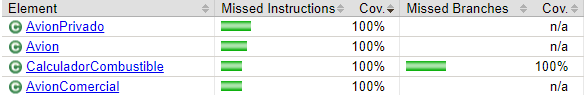
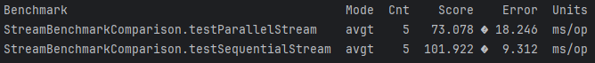

# Jacoco

## Benchmark

## Conclusiones

- **Stream**: Procesa los elementos de un flujo de manera secuencial, en un solo hilo. Cada elemento se procesa uno tras otro.
- **ParallelStream**: Puede mejorar el rendimiento en operaciones grandes al ejecutarse en paralelo, pero puede ser más complejo de depurar y no siempre garantiza una mejora significativa en todos los casos.
- El benchmark muestra que el ParallelStream tiene un tiempo promedio de ejecucion de 73.078 ms/op, que es más rápido en comparación a los 101/922 ms/op de SequentialStream.
- ParallelStream demuestra un mejor rendimiento, debido a su capacidad para utilizar múltiples núcleos de CPU para la ejecución concurrente. Esto lo hace adecuado para conjuntos de datos grandes o operaciones intensivas, donde la sobrecarga de la paralelización se compensa con las mejoras de rendimiento.
- Ambos flujos tienen un grado de variabilidad en sus tiempos de ejecución, pero el ParallelStream muestra un margen de error mayor (18.246 ms) en comparación con el SequentialStream (9.312 ms). Esta variabilidad se debe a la complejidad de gestionar hilos concurrentes.